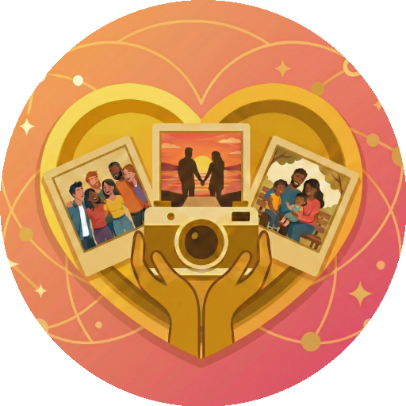
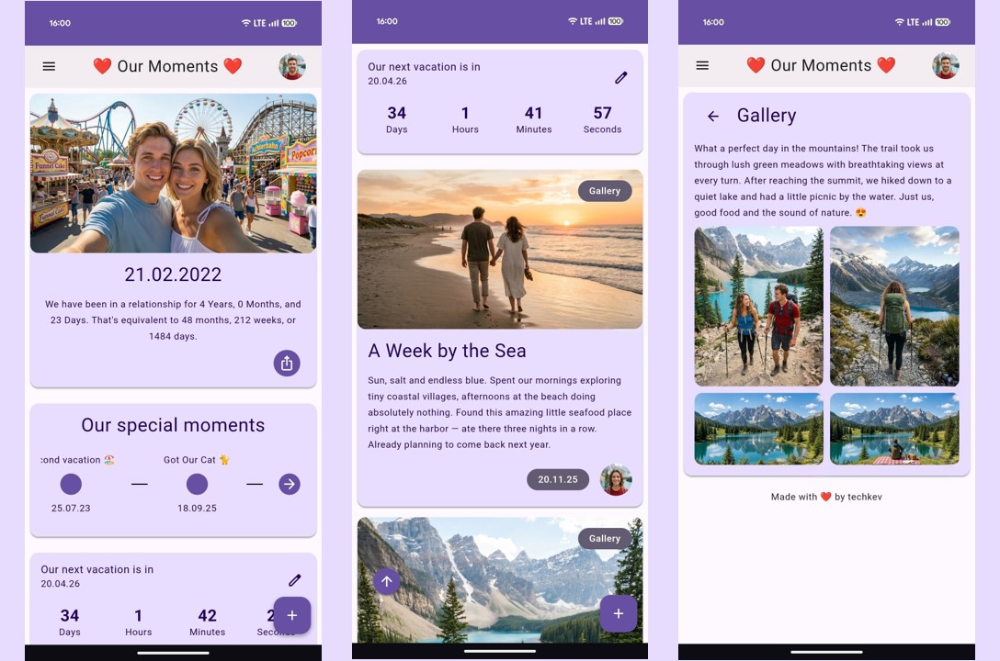
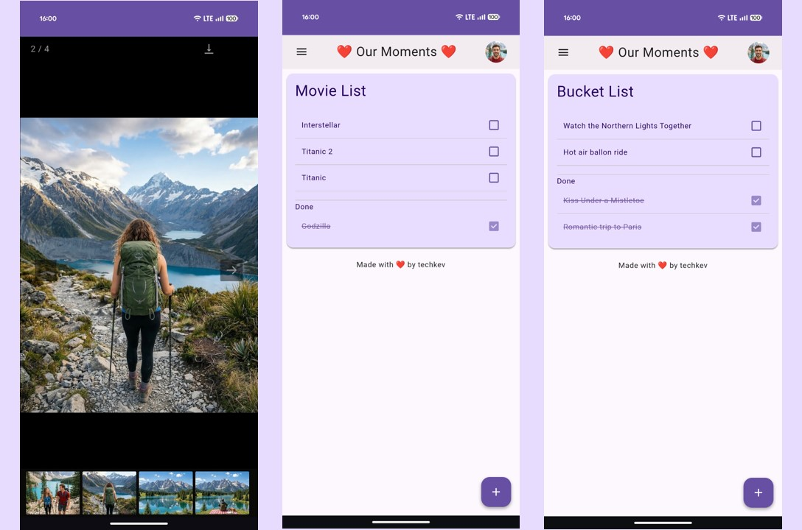
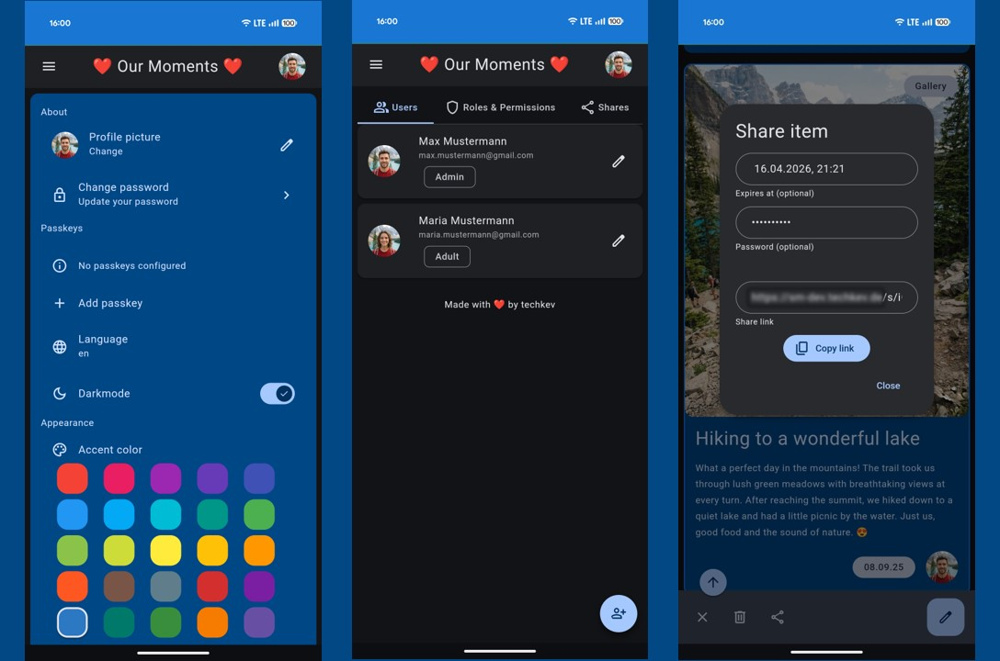

<h1>

<p>SharedMoments</p>
</h1>

**Your private space for shared memories — for couples, families, and friends.**


SharedMoments is a self-hosted web app that lets you capture and relive your most important moments together. Upload photos & videos, track milestones, set countdowns, and get notified on special days — all in a beautiful, modern interface.

## 📸 Screenshots

<br>
<br>

<br>
<br>


<br>

> ### [🚀 Try the Live Demo](https://sharedmoments.onrender.com/)
> The first load may take 20–30 seconds to start up.


## 💡 Features

### Core

- **Photo & Video Feed** — Upload and browse your shared moments on a personalized home page
- **Gallery** — Create albums for trips, events, and more
- **Timeline** — Chronicle significant moments (first kiss, moving in together, engagement, ...)
- **Countdown** — Set a timer for upcoming events with live countdown card
- **Banner** — Display your relationship duration in years, months, weeks, and days — exportable as an image
- **Custom Lists** — Movie list, bucket list, or create your own lists with custom icons and paths
- **Soundtrack** — Upload and play your song directly from the banner

### Editions

SharedMoments supports three editions, selectable during setup:

| Edition | Description |
|---------|-------------|
| **Couples** | For partners — relationship status, anniversary, engagement & wedding dates |
| **Family** | For families — family name, founding date |
| **Friends** | For friend groups — group name, founding date |

You can switch editions at any time without losing data.

### AI Writing Assistant

- Let AI help you write beautiful descriptions for your memories
- Supports **OpenAI**, **Anthropic (Claude)**, and **Ollama** (local/self-hosted)
- Customizable via environment variable

### Notifications

- **Push Notifications** — Delivered directly to your browser or phone (works automatically, no setup needed)
- **E-Mail** — Receive notifications via email
- **Telegram** — Get notified via Telegram bot
- Each user can choose their preferred notification channels in settings

### Reminder System

- **Annual** — Birthdays, anniversaries, wedding days (auto-synced from your data)
- **One-time** — Custom reminders for specific dates
- **Milestones** — Automatic reminders at 100, 365, 1000 days and more (up to 30 years)
- **Countdowns** — Get notified when a countdown reaches zero
- Mute individual reminders per user
- Choose how many days in advance you want to be notified

### Security & Authentication

- Secure login with email & password
- **Passkey** — Log in without a password using a security key
- **Password Reset** — Reset via email link on the login page (requires SMTP) or via CLI: `python manage.py set-password <email>`
- Manage users, roles, and permissions in the admin panel

### Sharing

- Share individual items via link
- Optional password protection
- Optional expiration date
- View counter (can be disabled)

### More

- **Install as Progressive Web App** — Add SharedMoments to your home screen on any device, with offline support
- **Dark Mode** — Per user setting
- **Accent Color** — Customize the look & feel per user
- **Multilingual** — German & English included, add more languages in the built-in [translation manager (See [Wiki](https://github.com/tech-kev/SharedMoments/wiki/Translation) for more Details)
- **Video Thumbnails** — Automatically generated
- **Data Export & Import** — Full backup and restore of all data and media as ZIP


## 📥 Installation

### Docker (recommended)

1. Create a `docker-compose.yml`:

```yaml
services:
  sharedmoments:
    image: techkev/sharedmoments
    container_name: sharedmoments
    restart: unless-stopped
    ports:
      - "5001:5001"
    volumes:
      - sm-database:/app/app/database
      - sm-uploads:/app/app/uploads
      - /etc/localtime:/etc/localtime:ro
    environment:
      - SECRET_KEY=CHANGE-ME

volumes:
  sm-database:
  sm-uploads:
```

2. Generate a secure secret key:

```bash
python3 -c "import secrets; print(secrets.token_hex(32))"
```

3. Start the container:

```bash
docker compose up -d
```

4. Open `http://your-ip:5001` and complete the [setup wizard](https://github.com/tech-kev/SharedMoments/wiki/Setup-Wizard).

> See the full [`docker-compose.yml`](docker-compose.yml) in this repo for all available options (AI, notifications, migration, etc.)

### Native Install Script

Supported on Debian/Ubuntu, Fedora/Rocky, CentOS:

```bash
curl -fsSL https://raw.githubusercontent.com/tech-kev/SharedMoments/main/install.sh | sudo bash
```

## 🔄 Updating

For Docker, pull and restart. For native installations, use the built-in update script:

```bash
sudo bash /opt/sharedmoments/update.sh
```

The script backs up your data, pulls the latest code, updates dependencies, and restarts the service. See the [wiki](https://github.com/tech-kev/SharedMoments/wiki/Installation) for details.

## ⚙️ Configuration

All configuration is done via environment variables. See the [Configuration](https://github.com/tech-kev/SharedMoments/wiki/Configuration) wiki page for all available options including AI providers, notifications, passkeys, demo mode, and more.

## 🔄 Migration from v1

Coming from SharedMoments v1? v2 includes a built-in migration tool that transfers your data from MySQL to SQLite. See the [Migration Guide](https://github.com/tech-kev/SharedMoments/wiki/Migration-from-v1) for step-by-step instructions.


## 🌍 Translation

Currently available languages:
- 🇩🇪 German
- 🇬🇧 English

New languages can be added directly in the built-in translation manager (accessible from the sidebar for users with the right permissions).

See the [wiki](https://github.com/tech-kev/SharedMoments/wiki/Translation) for details.


## 🛠️ Tech Stack

| Layer | Technology |
|-------|------------|
| **Backend** | Python 3.12, Flask, SQLAlchemy, SQLite |
| **Frontend** | Jinja2, JavaScript, BeerCSS (Material Design 3) |
| **AI** | OpenAI, Anthropic, Ollama |
| **Media** | ffmpeg, Pillow |
| **Deployment** | Docker (Gunicorn) or native (systemd) |


## 📝 Feature Requests

Have an idea? Please submit feature requests via the [issue section](https://github.com/tech-kev/SharedMoments/issues).

## 🐞 Bugs

Found a bug? Please open an [issue](https://github.com/tech-kev/SharedMoments/issues) and describe the problem.


## 💪 Motivation

I was looking for a website where my girlfriend and I could capture our moments together. When I couldn't find anything that met our needs, I started building my own. What began as a small side project grew into something much bigger — and eventually I decided to rebuild it from scratch and make it available to everyone.

SharedMoments v2 is a complete rewrite — born from everything I learned while building the first version. The more I worked on it, the stronger the desire grew to rebuild it from the ground up: cleaner under the hood, better architecture, and packed with new features like AI-assisted writing, passkey login, push notifications, and a full role & permission system. I also wanted to go beyond just couples, so v2 now comes in three editions — Couples, Family, and Friends — to fit different kinds of relationships.


## ❤️ Support

If you like this project, consider supporting it:

[](https://ko-fi.com/techkev)

## 📜 License

SharedMoments is licensed under the [GNU Affero General Public License v3.0](LICENSE).
